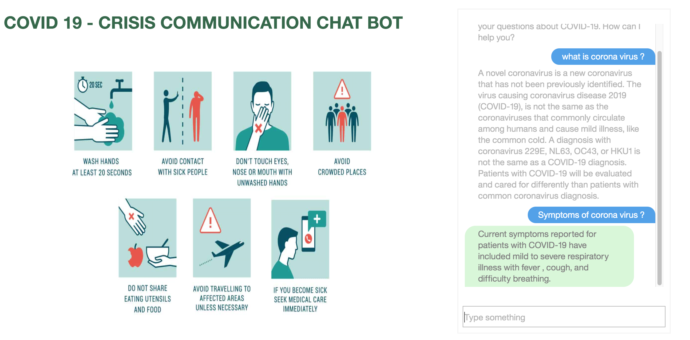

<h1 align="center" style="border-bottom: none;"> COVID - 19 CRISES COMMUNICATION CHATBOT</h1>
<h3 align="center">This prototype is developed for <b>IBM Call for Code challenge 2020</b> . Its a simple Node.js website application that is connected to a COVID-19 chatbot created using the IBM Watson Assistant APIs..</h3>



You can view a [demo][demo_url] of this app.

## Files in this repository
The files in this repository have the following purpose:
*  [watson-assistant/skill-CDC-COVID-FAQ.json](watson-assistant/skill-CDC-COVID-FAQ.json): Skill / Workspace file used with IBM Watson Assistant service
* [cloud-functions/covid/cloud-functions.js](cloud-functions/covid/cloud-functions.js): Code for cloud function actions which calls covid19api.
1. Other files in the covid-simple-chat bot are related to nodejs app. 

## Prerequisites
1. Sign up for an [IBM Cloud account](https://cloud.ibm.com/registration/).

1. You should already have a Watson Assistant service created when you deployed the COVID-19 Chat bot. You need to get the credentials from that chatbot to use in your Node.js application:
    - Log in to your IBM Cloud account.
    - Go to resources and open your Watson Assistant service instance.
    - You will be taken to Watson Assistant launch page. Click **Service Credentials** to view the service credentials.
      
    - You will use these credentials to populate the `.env` file when configuring the application below. Copy and save the JSON somewhere or leave this window open.
    
    
## Configuring the application

1. Clone the repository and cd into `covid-simple-chatbot`.

2. Copy the *.env.example* file to a file called *.env*

    ```
    cp .env.example .env
    ```

3. Open the *.env* file and add the service credentials that you obtained in the previous step. 

    The following example *.env* file configures the `apikey` and `url` for a Watson Assistant service instance hosted in the US East region:

    ```
    ASSISTANT_IAM_APIKEY=X4rbi8vwZmKpXfowaS3GAsA7vdy17Qhxxxxxxxx
    ASSISTANT_URL=https://gateway-wdc.watsonplatform.net/assistant/api
    ```

    - If your service instance uses `username` and `password` credentials, add the `ASSISTANT_USERNAME` and `ASSISTANT_PASSWORD` variables to the *.env* file.

    The following example *.env* file configures the `username`, `password`, and `url` for a Watson Assistant service instance hosted in the US South region:

    ```
    ASSISTANT_USERNAME=522be-7b41-ab44-dec3-xxxxxxxx
    ASSISTANT_PASSWORD=A4Z5BdGENxxxx
    ASSISTANT_URL=https://gateway.watsonplatform.net/assistant/api
    ```
    
    However, if your credentials contain an IAM API key, copy the `apikey` and `url` to the relevant fields.
    
    ```JSON
      {
        "apikey": "ca2905e6-7b5d-4408-9192-xxxxxxxx",
        "iam_apikey_description": "Auto generated apikey during resource-key ...",
        "iam_apikey_name": "auto-generated-apikey-62b71334-3ae3-4609-xxxxxxxx",
        "iam_role_crn": "crn:v1:bluemix:public:iam::::serviceRole:Manager",
        "iam_serviceid_crn": "crn:v1:bluemix:public:iam...",
        "url": "https://gateway-syd.watsonplatform.net/assistant/api"
      }
    ```
   
   ```
    ASSISTANT_IAM_APIKEY=ca2905e6-7b5d-4408-9192-xxxxxxxx
    ```

4. Add the `ASSISTANT_ID` to the previous properties:

    ```
    ASSISTANT_ID=522be-7b41-ab44-dec3-xxxxxxxx
    ```


## Running locally

1. Install the dependencies:

    ```
    npm install
    ```

1. Run the application:

    ```
    npm start
    ```

1. View the application in a browser at `localhost:3000`.


[demo_url]:https://covid-assistant-simple-vijaygs.mybluemix.net/
